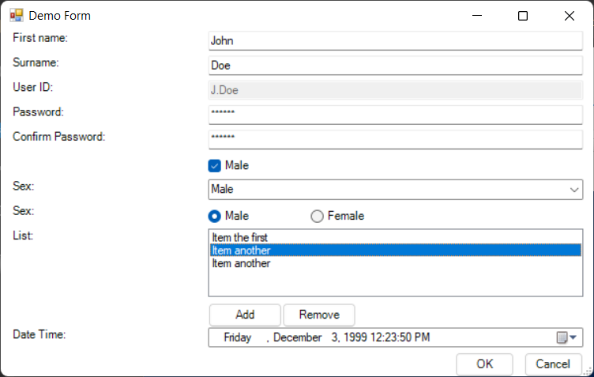

# QuickForms

Quick and simple 2 column (label, control) PowerShell GUI form module, 
supporting the following controls:

- ```TextBox```
- ```CheckBox```
- ```ComboBox```
- ```RadioBox``` (Panel of RadioButtons)
- ```ListBox``` (with optional user specified Buttons)
- ```DateTimePicker```
- ```FileBox``` (file Open and SaveAs)

Example (the included **demo.ps1** form):



Callbacks can be easily attached to the most common control events e.g. 
```TextChanged``` event for ```TextBox``` and ```PasswordBox``` controls.

Form layout is managed by the module in order to reduce the
time required to strap a GUI onto existing scripts and improve
readability by requiring only terse initialisation and logic.

## Install

Install from PSGallery;

``` PowerShell
Install-Module QuickForms
```

Or copy **QuickForms.psm1** and **QuickForms.psd1** to your script path for 
portability.

## Use

The general workflow is;

- Import module
- Initialise form
- Add control rows (in display order)
- Add action (OK, Cancel buttons)
- Show form

## Import module

If installed:

``` PowerShell
Import-Module QuickForms
```

If installed in the same directory as your script:

``` PowerShell
Import-Module .\QuickForms.psd1
```

Note: if installed in the same directory as script you must import the .psd1
file (not the .psm1 file) in order to satisfy a dependency on the 
System.Windows.Forms assemblies.

## Initialise form

```New-QuickForm``` is used to initialise a new form.

``` PowerShell
$MyForm = New-QuickForm -Title "Demo Form" -LabelWidth 200 -ControlWidth 400
```

| Argument | Mandatory | Type | Description |
| --- | --- | --- | --- |
| [-Title "\<value>"] | No | String | title displayed in title bar (default: "My Form") |
| [-LabelWidth \<value>] | No | Int | width of labels column in pixels (default: 200) |
| [-ControlWidth \<value>] | No | Int | width of controls column in pixels (default: 400)


---

## Add-TextBox

``` PowerShell
$Firstname = Add-TextBox -Form $MyForm `
    -Label "Firstname:" `
    -Callback { $Firstname.Text = $Firstname.Text.ToUpper() }
```

| Argument | Mandatory | Type | Description |
| --- | --- | --- | --- |
| -Form \<value> | Yes | QuickForm | form to add to, can be passed on pipeline |
| -Label "\<value>" | No | String | label |
| [-Mask "\<value>" ] | No | String | Optional input mask |
| [-Password] | No | Switch | Hide input |
| [-Rows <value>] | No | Int | text input rows, default = 1 |
| [-Disabled] | No | Switch | disable control |
| [-Text "\<value>"] | No | String | set initial control ```.Text``` value |
| [-Callback {ScriptBlock}] | No | ScriptBlock | bound to ```TextChanged``` event |

Access the value of the control via its ```.Text``` property.

Optional ```-Mask``` parameter can be used to define an input mask that will
constrain text input.  Refer [here](https://learn.microsoft.com/en-us/dotnet/api/system.windows.forms.maskedtextbox.mask?view=windowsdesktop-6.0) 
for mask syntax. e.g.

``` PowerShell
$MyDate = Add-TextBox -Form $MyForm `
    -Label "Date:" `
    -Mask "00/00/0000"
```

Optional ```-Password``` switch hides input behind "*" characters.  Note that the
input is not encrypted hence is not secure. e.g.

``` PowerShell
$MyPassword = Add-TextBox -Form $MyForm `
    -Label "Password:" `
    -Password
```

Optional ```-Rows``` parameter enables MultiLine text input, with values greater
than 1.  Note that the height of each row is the height of a control row, not
a row of text, hence specifying a value of 2 will likely result in more
than 2 rows of text being visible in the control.  The value of the parameter is 
ignored if used in combination with ```-Mask```.

``` PowerShell
$MyNotes = Add-TextBox -Form $MyForm `
    -Label "Notes:" `
    -Rows 2
```

Optional ```-Disabled``` parameter disables the control for input (sets ```.Enabled = $false```).

Optional ```-Text``` parameter sets the initial value in the TextBox.

Optional ```-Callback``` parameter binds the supplied ScriptBlock to the TextBox
controls ```TextChanged``` event.

---

## Add-CheckBox

``` PowerShell
$Enabled = Add-CheckBox -Form $MyForm `
    -Label "Enabled:" `
    -Callback { Write-Host $this.Checked }
```
| Argument | Mandatory | Type | Description |
| --- | --- | --- | --- |
| -Form \<value> | Yes | QuickForm | form to add to, can be passed on pipeline |
| -Label "\<value>" | Yes | String | label, displayed right of control, not in label column |
| [-Disabled] | No | Switch | disable control |
| [-Checked] | No | Switch | check the control (default: unchecked) |
| [-Callback {ScriptBlock}] | No | ScriptBlock | bound to ```CheckedChanged``` event |

Access the boolean value of the control via its ```.Checked``` property. 

Optional ```-Disabled``` parameter disables the control for input (sets ```.Enabled = $false```).

Optional ```-Checked``` parameter can be used to set the CheckBox's ```.Checked``` 
property to ```$true```, default is ```$false```.

Optional ```-Callback``` parameter binds the supplied ScriptBlock to the CheckBox
controls ```CheckedChanged``` event.

---

## Add-ComboBox

``` PowerShell
$Gender = Add-ComboBox -Form $MyForm `
    -Label "Gender:" `
    -Options @("Male", "Female") `
    -Callback { Write-Host $Gender.SelectedItem }
```

| Argument | Mandatory | Type | Description |
| --- | --- | --- | --- |
| -Form \<value> | Yes | QuickForm | form to add to, can be passed on pipeline |
| -Label "\<value>" | No | String | label |
| [-Options @("\<value1>","\<value2>",etc.)] | No | Array of Strings | ComboBox options |
| [-Disabled] | No | Switch | disable control |
! [-SelectedItem "\<value>" ] No | String | set selected item by text value |
| [-SelectedIndex <value>] | No | Int | set selected item by index, has precedence over ```-SelectedItem``` |
| [-Callback {ScriptBlock}] | No | ScriptBlock | bound to ```SelectedValueChanged``` event |

```.SelectedItem``` property contains the text of the currently selected item.

```.SelectedIndex``` property contains the index of the currently selected item, 
or ```-1``` if a selection hasn't yet been made.

```.Items``` property contains the array of items.

Call ```.Items.Add("<value>")``` method to add a new item.

Call ```.Items.RemoveAt("<index>")``` method to remove an item by index 
e.g. ```.SelectedIndex``` property.

Call ```.Items.Remove("<value>")``` method to remove an item by name (randomly 
where multiple items with the same name appear in the list).

Optional ```-Disabled``` parameter disables the control for input (sets ```.Enabled = $false```).

Optional ```-SelectedItem``` parameter selects the ComboBox item with the specified
text/name.

Optional ```-SelectedIndex``` parameter selects the ComboBox item with the specified
integer index, and takes precedence over any value supplied via ```-SelectedItem```.

Optional ```-Callback``` parameter binds the supplied ScriptBlock to the CheckBox
controls ```SelectedValueChanged``` event.

---

## Add-ListBox

``` PowerShell
$MyList = Add-ListBox -Form $MyForm ``
    -Label "List:" `
    -Rows 4 `
    -Options @("Item 1", "Item 2") `
    -Callback { Write-Host $MyList.SelectedItem }
```

... or add a row of buttons (underneath) for interacting with the 
list:

``` PowerShell
$MyList = Add-ListBox -Form $MyForm `
    -Label "List:" `
    -Options @("Item the first") `
    -Callback { Write-Host $MyList.SelectedItem } `
    -Buttons @(
        @{ name="Add"; callback={ $MyList.Items.Add("Item another") } },
        @{ name="Remove"; callback={
                if ( $MyList.SelectedIndex -ne -1 ) {
                    $MyList.Items.RemoveAt( $MyList.SelectedIndex )
                }
            } 
        }
    )
```

| Argument | Mandatory | Type | Description |
| --- | --- | --- | --- |
| -Form \<value> | Yes | QuickForm | form to add to, can be passed on pipeline |
| -Label "\<value>" | No | String | label |
| [-Options @("\<value1>","\<value2>",etc.)] | No | Array of Strings | ListBox options |
| [-Rows \<value>] | No | Int | number of list item rows (default:3) |
! [-SelectedItem "\<value>" ] No | String | set selected item by text value |
| [-SelectedIndex <value>] | No | Int | set selected item by index, has precedence over ```-SelectedItem``` |
| [-Callback {ScriptBlock}] | No | ScriptBlock | bound to ```SelectedValueChanged``` event |
| [-Buttons @(..)] | No | Array of Hashtables | buttons to display below list, as array of name, callback hashtables (refer notes) |

```.SelectedItem``` property contains the text of the currently selected item.

```.SelectedIndex``` property contains the index of the currently selected item, 
or ```-1``` if a selection hasn't yet been made.

```.Items``` property contains the array of items.

Call ```.Items.Add("<value>")``` method to add a new item.

Call ```.Items.RemoveAt("<index>")``` method to remove an item by index 
e.g. ```.SelectedIndex``` property.

Call ```.Items.Remove("<value>")``` method to remove an item by name (randomly 
where multiple items with the same name appear in the list).

Optional ```-Disabled``` parameter disables the control for input (sets ```.Enabled = $false```).

Optional ```-SelectedItem``` parameter selects the ComboBox item with the specified
text/name.

Optional ```-SelectedIndex``` parameter selects the ComboBox item with the specified
integer index, and takes precedence over any value supplied via ```-SelectedItem```.

Optional ```-Callback``` parameter binds the supplied ScriptBlock to the CheckBox
controls ```SelectedValueChanged``` event.

```Buttons``` is an optional array of hashtable's containing ```name``` (button text) 
and ```callback``` (called when button pressed) properties e.g.

``` PowerShell
@(
    @{ name="Add"; callback={} },
    @{ name="Remove"; callback={} }
)
```

---

## Add-RadioBox

``` PowerShell
$MyRadios = Add-RadioBox -Form $demo   
    -Label "Sex:" `
    -Options @("Male", "Female") `
    -Horizontal `
    -Callback { if ( $this.Checked ) { Write-Host $this.Text } }
```

| Argument | Mandatory | Type | Description |
| --- | --- | --- | --- |
| -Form \<value> | Yes | QuickForm | form to add to, can be passed on pipeline |
| -Label "\<value>" | No | String | label |
| [-Options @("\<value1>","\<value2>",etc.)] | No | Array of Strings | RadioButton options |
| [-Horizontal] | No | | align RadioButtons horizontally, no attempt to prevent overflow - default layout is vertical | 
| [-Disabled] | No | Switch | disable control |
| [-SelectedItem "\<value>"] | No | String | set initially checked RadioBox |
| [-Callback {ScriptBlock}] | No | ScriptBlock | bound to ```CheckedChanged``` event of **all** RadioButtons |

Returns a **Panel** of RadioButtons, individual RadioButtons can be accessed 
through the Panels ```.Controls``` array.

Optional ```-Horizontal``` parameter specifies to layout the RadioButton's horizontally
rather than vertically (the default).  No attempt is made to prevent the resulting 
layout from overflowing the width of the form (if it does, increase the ```-ControlWidth```
of the form, or select the default vertical control layout).

Optional ```-Disabled``` parameter disables the control for input (sets ```.Enabled = $false```).

Optional ```-SelectedItem``` parameter selects the RadioButton with the specified
text/name.

Optional ```-Callback``` parameter binds the supplied ScriptBlock to all the RadioButton
controls ```CheckedChanged``` events - use the ```.Checked``` property of a 
RadioButton in the ```.Controls``` array to determine whether it is selected, 
and/or the ```.PerformClick()``` method to select it e.g.

``` PowerShell
$MyRadio = Add-RadioBox -Form $MyForm `
    -Label "Test:" `
    -Options @("Test1", "Test2", "Test3) `
    -Callback {
        $MyRadio.Controls | %{ if ($_.Checked) {  Write-Host $_.Text } }
    }

$MyRadio.Controls | Where Text -eq "Test2" | %{ $_.PerformClick() }
```

---

## Add-DateTimePicker

``` PowerShell
$MyDateTime = Add-DateTimePicker -Form $demo `
            -Label "Date Time:" `
            -Type DateTime `
            -DateTime (Get-Date -Year 1999 -Month 12 -Day 3 -Hour 12 -Minute 23) `
            -Callback { Write-Host $this.Value }
```

| Argument | Mandatory | Type | Description |
| --- | --- | --- | --- |
| -Form \<value> | Yes | QuickForm | form to add to, can be passed on pipeline |
| -Label "\<value>" | No | String | label |
| [-Type Date|Time|DateTime] | No | Option | type (default:Date) |
| [-DateTime \<value>] | No | DateTime | initial Date/Time is specified using ```Get-Date``` (default: now) |
| [-Disabled] | No | Switch | disable control |
| [-Callback {ScriptBlock}] | No | ScriptBlock | bound to ```ValueChanged``` event |

Access the value of the control via its ```.Value``` property.

Optional ```-DateTime``` parameter is used to set the controls Date and Time.
Construct the value using ```Get-DateTime```.  If not specified the controls
value defaults to now.

Optional ```-Disabled``` parameter disables the control for input (sets ```.Enabled = $false```).

Optional ```-Callback``` parameter binds the supplied ScriptBlock to the controls 
```ValueChanged``` event.

---

## Add-FileBox

``` PowerShell
$MySaveFile = Add-FileBox -Form $demo `
                -Label "Save as:" `
                -Type "SaveAs" `
                -FileFilter "txt files (*.txt)|*.txt|All files (*.*)|*.*" `
                -Callback { Write-Host $MySaveFile.Text }

```

| Argument | Mandatory | Type | Description |
| --- | --- | --- | --- |
| -Form \<value> | Yes | QuickForm | form to add to, can be passed on pipeline |
| -Label "\<value>" | No | String | label |
| [-Type Open|SaveAs] | No | Option | dialog type (default:Open) |
| [-FileFilter "\<value>"] | No | String | file filter (refer notes) |
| [-Callback {ScriptBlock}] | No | ScriptBlock | bound to ```TextChanged``` event |

Returns a TextBox control whose ```.Text``` value is populated by the Open or
SaveAs dialog displayed when the ```...``` button is pressed.

Optional ```-FileFilter``` can be used to specify the default (1st), and other,
file formats/patterns/extensions to be supported - format is defined by the 
system Open and SaveAs options, reference [here](https://learn.microsoft.com/en-us/dotnet/api/system.windows.forms.filedialog.filter?view=windowsdesktop-6.0#system-windows-forms-filedialog-filter) e.g.

``` PowerShell
-FileFilter "txt files (*.txt)|*.txt|All files (*.*)|*.*"
```

Optional ```-Callback``` parameter binds the supplied ScriptBlock to the TextBox 
controls ```TextChanged``` event.

---

## Add-Action

``` Powershell
Add-Action -Form $MyForm `
    -Callback { $this.parent.Close(); Write-Host "OK Selected" }
```

| Argument | Mandatory | Type | Description |
| --- | --- | --- | --- |
| -Form \<value> | Yes | QuickForm | form to add to, can be passed on pipeline |
| [-Callback {ScriptBlock}] | No | ScriptBlock | bound to OK buttons ```Click``` event |


Add the customary OK and Cancel buttons to the form, optionally 
with a callback for the OK button, which is commonly used to
verify validity of entered data before closing the form and
proceeding.

This is typically called after all controls are added to a form,
before it is shown.

If Callback is specified for the OK button it will be required
to explicitly close the form (if warranted) e.g. via ```$this.parent.close()```

You likely want to set some value in the Callback to inform
latter code that the form was closed via OK, rather than
Cancelled.

``` PowerShell
Add-Action -Form $MyForm -Callback {
    # verify values
    $ExitCode = 1
    $this.parent.close()
}
```

---

## Show form
Display the form.

```PowerShell
$MyForm.Show()
```

---

## Tips and tricks

### Pipeline
Add-<Control> and Add-Action cmdlets accept a form on the pipeline e.g.

``` Password
$MyTextBox = $MyForm | Add-TextBox -Label "Text entry:"
```

### $this
You can refer to the current control as ```$this``` within its Callback e.g.

``` PowerShell
$MyCheckbox = Add-CheckBox -Form $MyForm -Callback { Write-Host $this.Checked }
```

### Add form properties

It can be useful to add properties to the form to e.g. replace the functionality
of hidden fields, or record an exit code.

``` PowerShell
$form = New-QuickForm -Title "Test Form"

# add fields
$form | Add-Member -NotePropertyName "ExitCode" -NotePropertyValue 0
$form | Add-Member -NotePropertyName "HiddenCalculatedValue" -NotePropertyValue ""

# add controls

Add-Action -Form $MyForm -Callback {
    $form.ExitCode = 1
    $this.parent.Close()
}

if ($form.ExitCode -eq 1) {
    # do work
} else { Write-Host "Form Cancelled" }

```

### Label columnless forms

In some instances (e.g. a search dialog) it might be desirable to do without the
label column, and labels, e.g.;

``` PowerShell
$form = New-QuickForm -Title "Search" -LabelWidth 0
$SearchString = $form | Add-TextBox
$SearchResult = $form | Add-ListBox -Rows 5
$form | Add-Action
$form.Show()
```

### Form logic

For brevity it's probably preferable to author one ```Update-Fields``` function
to manage control logic and bind it to the callback of all (or most) enabled
controls. 
