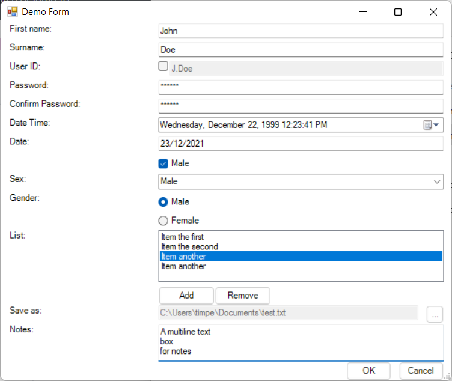

# QuickForms

Quick and simple 2 column (label, control) PowerShell GUI form module, 
supporting the following controls:

- ```TextBox```
- ```PasswordBox``` (TextBox with hidden input)
- ```CheckBox```
- ```ComboBox```
- ```RadioBox``` (Panel of RadioButtons)
- ```ListBox``` (with optional user specified Buttons)
- ```DateTimePicker```
- ```FileBox``` (file Open and SaveAs)

Example (the included **demo.ps1** form):



Callbacks can be easily attached to the most common control events e.g. 
```TextChanged``` event for ```TextBox``` and ```PasswordBox``` controls.

Form layout is managed by the module in order to reduce the
time required to strap a GUI onto existing scripts and improve
readability by requiring only terse initialisation and logic.

## Install

Install from PSGallery;

``` PowerShell
Install-Module QuickForms
```

Or copy **QuickForms.psm1** and **QuickForms.psd1** to your script path for 
portability.

## Use

The general workflow is;

- Import module
- Initialise form
- Add control rows (in display order)
- Add action (OK, Cancel buttons)
- Show form

### Import module

If installed:

``` PowerShell
Import-Module QuickForms
```

If installed in the same directory as your script:

``` PowerShell
Import-Module .\QuickForms.psd1
```

Note: if installed in the same directory as script you must import the .psd1
file (not the .psm1 file) in order to satisfy a dependency on the 
System.Windows.Forms assemblies.

### Initialise form

```New-QuickForm``` is used to initialise a new form.

``` PowerShell
$MyForm = New-QuickForm -Title "Demo Form" -LabelWidth 200 -ControlWidth 400
```

| Argument | Mandatory | Type | Description |
| --- | --- | --- | --- |
| [-Title "\<value>"] | No | String | Title to be displayed in the forms title bar (default: "My Form") |
| [-LabelWidth \<value>] | No | Int | Width of labels column in pixels (default: 200) |
| [-ControlWidth \<value>] | No | Int | Width of controls column in pixels (default: 400)

### Add controls rows

#### TextBox

``` PowerShell
$Firstname = Add-TextBox -Form $MyForm `
    -Label "Firstname:" `
    -Callback { $Firstname.Text = $Firstname.Text.ToUpper() }
```

| Argument | Mandatory | Type | Description |
| --- | --- | --- | --- |
| -Label "\<value>" | Yes | String | Control label |
| [-Callback {ScriptBlock}] | No | ScriptBlock | bound to ```TextChanged``` event. |

Access the value of the control via its ```.Text``` property. 

#### PasswordBox

``` PowerShell
$Password = Add-PasswordBox -Form $MyForm `
    -Label "Password:" `
    -Callback { Write-Host $Password.Text }
```

| Argument | Mandatory | Type | Description |
| --- | --- | --- | --- |
| -Label "\<value>" | Yes | String | Control label |
| [-Callback {ScriptBlock}] | No | ScriptBlock | bound to ```TextChanged``` event. |

Access the value of the control via its ```.Text``` property. 

#### CheckBox

``` PowerShell
$Enabled = Add-CheckBox -Form $MyForm `
    -Label "Enabled:" `
    -Callback { Write-Host $this.Checked }
```
| Argument | Mandatory | Type | Description |
| --- | --- | --- | --- |
| -Label "\<value>" | Yes | String | Control label, displayed left of control |
| [-Callback {ScriptBlock}] | No | ScriptBlock | bound to ```CheckedChanged``` event. |

Access the boolean value of the control via its ```.Checked``` property. 

#### ComboBox

``` PowerShell
$Gender = Add-ComboBox -Form $MyForm `
    -Label "Gender:" `
    -Options @("Male", "Female") `
    -Callback { Write-Host $Gender.SelectedItem }
```

| Argument | Mandatory | Type | Description |
| --- | --- | --- | --- |
| -Label "\<value>" | Yes | String | Control label, displayed left of control |
| [-Options @("\<value1>","\<value2>",etc.)] | No | Array of Strings | Available ComboBox options |
| [-Callback {ScriptBlock}] | No | ScriptBlock | bound to ```SelectedValueChanged``` event. |

```.SelectedItem``` property contains the text of the currently selected item.

```.SelectedIndex``` property contains the index of the currently selected item, 
or ```-1``` if a selection hasn't yet been made.

```.Items``` property contains the array of items.

Call ```.Items.Add("<value>")``` method to add a new item.

Call ```.Items.RemoveAt("<index>")``` method to remove an item by index 
e.g. ```.SelectedIndex``` property.

Call ```.Items.Remove("<value>")``` method to remove an item by name (randomly 
where multiple items with the same name appear in the list).

#### ListBox

``` PowerShell
$MyList = Add-ListBox -Form $MyForm ``
    -Label "List:" `
    -Rows 4 `
    -Options @("Item 1", "Item 2") `
    -Callback { Write-Host $MyList.SelectedItem }
```

... or add a row of buttons (underneath) for interacting with the 
list:

``` PowerShell
$MyList = Add-ListBox -Form $MyForm `
    -Label "List:" `
    -Options @("Item the first") `
    -Callback { Write-Host $MyList.SelectedItem } `
    -Buttons @(
        @{ name="Add"; callback={ $MyList.Items.Add("Item another") } },
        @{ name="Remove"; callback={
                if ( $MyList.SelectedIndex -ne -1 ) {
                    $MyList.Items.RemoveAt( $MyList.SelectedIndex )
                }
            } 
        }
    )
```

```Rows```, ```Options```, ```Callback``` and ```Buttons``` are optional.

```Rows``` defaults to 3.  

```Buttons``` is an array of hashtable's containing ```name``` (button text) 
and ```callback``` (called when button pressed) properties e.g.

``` PowerShell
@(
    @{ name="Add"; callback={} },
    @{ name="Remove"; callback={} }
)
```

Callback is bound to ```SelectedValueChanged``` event.

```.SelectedItem``` property contains the text of the currently selected item.

```.SelectedIndex``` property contains the index of the currently selected item, 
or ```-1``` if a selection hasn't yet been made.

```.Items``` property contains the array of items.

Call ```.Items.Add("<value>")``` method to add a new item.

Call ```.Items.RemoveAt("<index>")``` method to remove an item by index 
e.g. ```.SelectedIndex``` property.

Call ```.Items.Remove("<value>")``` method to remove an item by name (randomly 
where multiple items with the same name appear in the list).

### RadioBox

``` PowerShell
$MyRadios = Add-RadioBox -Form $demo   
    -Label "Sex:" `
    -Options @("Male", "Female") `
    -Horizontal `
    -Callback { if ( $this.Checked ) { Write-Host $this.Text } }
```

Returns a Panel of RadioButtons according to the ```-Options``` array.

Individual RadioButtons can be accessed through the Panels ```.Controls``` array.

Default orientation is vertical i.e. the Panel will consume as many rows as elements 
in the Options array.  The ```-Horizontal``` option causes the RadioButton's to be 
presented horizontally but no attempt is made to prevent overflow of the forms width.

Optional ```Callback``` is bound to the ```CheckedChanged``` event of __all__ 
RadioButtons.

Use the ```.Checked``` property of a RadioButton in the ```.Controls``` array
to determine whether it is selected, and/or the ```.PerformClick()``` method to 
select it e.g.

``` PowerShell
$MyRadio = Add-RadioBox -Form $MyForm `
    -Label "Test:" `
    -Options @("Test1", "Test2", "Test3) `
    -Callback {
        $MyRadio.Controls | %{ if ($_.Checked) {  Write-Host $_.Text } }
    }

$MyRadio.Controls | Where Text -eq "Test2" | %{ $_.PerformClick() }
```

### DateTimePicker

``` PowerShell
$MyDateTime = Add-DateTimePicker -Form $demo `
            -Label "Date Time:" `
            -Type DateTime `
            -DateTime (Get-Date -Year 1999 -Month 12 -Day 3 -Hour 12 -Minute 23) `
            -Callback { Write-Host $this.Value }
```

Returns a DateTimePicker control with specified Label.

Optional ```-Type``` can be either ```Date```, ```Time``` or both (```DateTime```)
and defaults to ```Date```.

Optional initial Date/Time is specified using ```-DateTime``` which must normally
be constructed using the ```Get-Time``` cmdlet (defaults to current Date & Time).

Optional ```Callback``` is bound to the controls ```ValueChanged``` event.

Access the value of the control via its ```.Value``` property. 

### FileBox

``` PowerShell
$MySaveFile = Add-FileBox -Form $demo `
                -Label "Save as:" `
                -Type "SaveAs" `
                -FileFilter "txt files (*.txt)|*.txt|All files (*.*)|*.*" `
                -Callback { Write-Host $MySaveFile.Text }

```

Returns a TextBox control whose ```.Text``` value is populated by the Open or
SaveAs dialog displayed when the ```...``` button is pressed.

Optional ```-Type``` can be ```Open``` or ```SaveAs``` for the corresponding
dialog functionality (defaults to ```Open```).

Optional ```-FileFilter``` can be used to specify the default (1st), and other,
file formats/patterns/extensions to be supported.  Format is defined by the 
system Open and SaveAs options e.g.

``` PowerShell
-FileFilter "txt files (*.txt)|*.txt|All files (*.*)|*.*"
```

Optional ```-Callback``` is bound to the TextBox's ```TextChanged``` event.

Path and filename are accessible via the returned TextBox controls ```.Text```
property. 

### Add action

``` Powershell
Add-Action -Form $MyForm `
    -Callback { $this.parent.Close(); Write-Host "OK Selected" }
```

Add the customary OK and Cancel buttons to the form, optionally 
with a callback for the OK button, which is commonly used to
verify validity of entered data before closing the form and
proceeding.

This is typically called after all controls are added to a form,
before it is shown.

If Callback is specified for the OK button it will be required
to explicitly close the form (if warranted) e.g. via ```$this.parent.close()```

You likely want to set some value in the Callback to inform
latter code that the form was closed via OK, rather than
Cancelled.

``` PowerShell
Add-Action -Form $MyForm -Callback {
    # verify values
    $ExitCode = 1
    $this.parent.close()
}
```

### Show form
Display the form.

```PowerShell
$MyForm.Show()
```

## Tips and tricks

### Pipeline
Add-<Control> and Add-Action cmdlets accept a form on the pipeline e.g.

``` Password
$MyTextBox = $MyForm | Add-TextBox -Label "Text entry:"
```

### $this
You can refer to the current control as ```$this``` within its Callback e.g.

``` PowerShell
$MyCheckbox = Add-CheckBox -Form $MyForm -Callback { Write-Host $this.Checked }
```

### Form logic

For brevity it's probably preferable to author one ```Update-Fields``` function
to manage control logic and bind it to the callback of all (or most) enabled
controls. 

### Add form properties

It can be useful to add properties to the form to e.g. replace the functionality
of hidden fields, or record an exit code.

``` PowerShell
$form = New-QuickForm -Title "Test Form"

# add fields
$form | Add-Member -NotePropertyName "ExitCode" -NotePropertyValue 0
$form | Add-Member -NotePropertyName "HiddenCalculatedValue" -NotePropertyValue ""

# add controls

Add-Action -Form $MyForm -Callback {
    $form.ExitCode = 1
    $this.parent.Close()
}

if ($form.ExitCode -eq 1) {
    # do work
} else { Write-Host "Form Cancelled" }

```